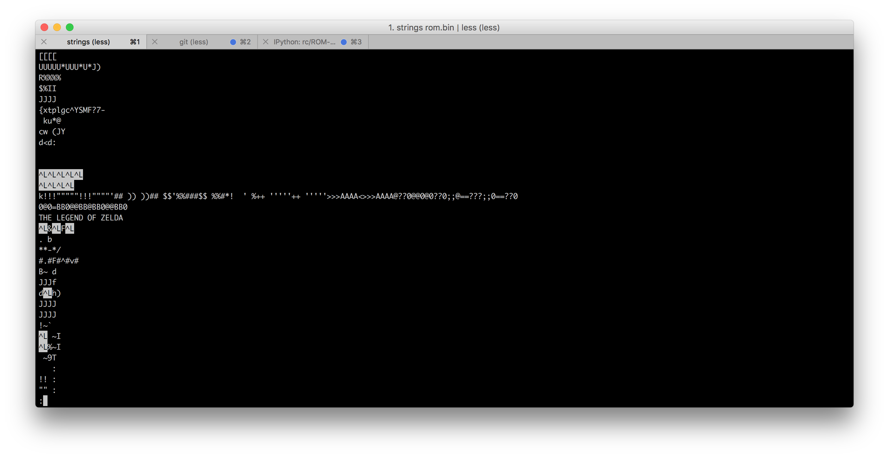

# ROM-Dump

Scripts and code for ROM dump.

## Bash commands used
Breaks binary into smaller, viewable image files, with headers
```bash
for n in $(seq 0 10); do dd if=../legend.bin skip=$(($n * 80000)) bs=1 count=80000 of=$n.bin; echo "P4 8 10000 " > $n.pgm; cat $n.bin >> $n.pgm; done
```

Copies first 2**19 bytes; the size of the ROM because there are 19 address bits; copies without filesystem `/usr/share/file/magic`
```bash
dd if=rom.bin of=rom_low_clean.bin bs=1 count=$((2**19))
```

Rename using curlies
```bash
mv full_dump_d0_d5_{falling,rising}_edge.txt
```

Misc.
```bash
hexdump rom_full.bin            # see all hex values
xxd -c 32 rom_full.bin
radiff2 -c rom_full.bin rom_official.bin
binwalk -E rom_full.bin         # to find where interesting data might be
strings rom_full.bin            # find strings
```



## Thank you!

Thank you [Cameron](https://github.com/cfinucane) for pairing with me on this, your Python, Bash and Linux skills are super impressive, and I’m grateful to have learned so much from you in this endeavor!

Thank you [Avery](https://github.com/AveryEMcG) for being a super awesome person, for sharing your hardware expertise and your game console wisdom!

Thank you [Ben](https://twitter.com/benjojo12) and [Steven](https://github.com/SlySteven) for reviewing this blog post and providing valuable feedback!

Thank you [Phoebe](https://twitter.com/f2xeb) for your wonderful talk that expired this exploration!

Thank you [Recurse Center](https://www.recurse.com/) for providing the space and tools to make this happen!


